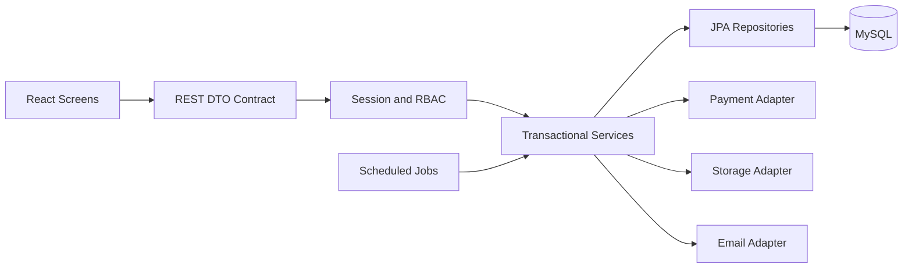
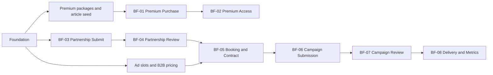
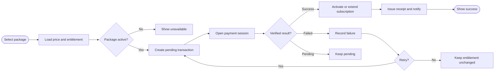
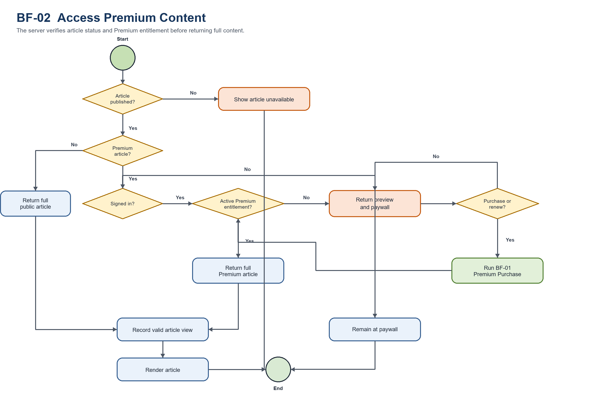
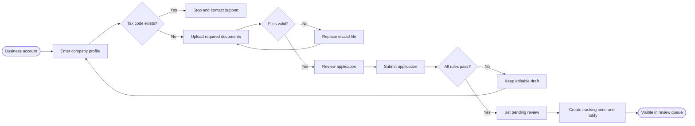
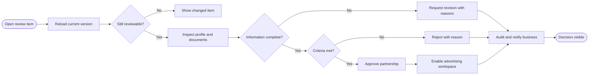
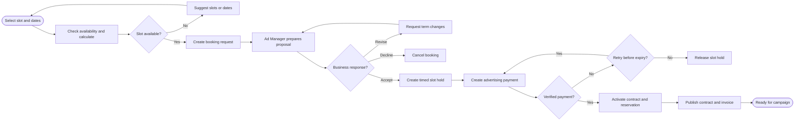
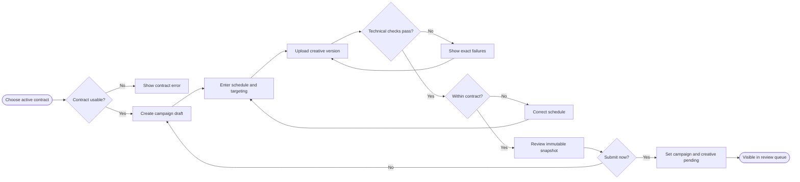
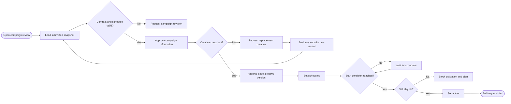

# Coding Plan — Premium News and Advertising Management System

## 1. Mục tiêu và nguyên tắc

Mục tiêu của plan là để bốn thành viên code song song nhưng vẫn ghép được với nhau. Đơn vị nhỏ nhất là Screen; Screen triển khai một hoặc nhiều Use Case; Use Case thuộc Main Flow hoặc Supporting Flow.

Quy tắc bắt buộc:

- Frontend chỉ gọi REST API; không truy cập MySQL.
- Controller → Service → Repository; business rule chỉ nằm ở Service.
- DTO là hợp đồng API; không trả JPA Entity ra ngoài.
- Mọi thay đổi schema là một Flyway migration mới; không sửa migration đã chạy ở môi trường chung.
- Payment callback, job và submit action phải idempotent.
- Mọi dữ liệu của Business phải kiểm tra `company_id` ở backend, không chỉ ẩn nút ở frontend.
- Thời gian lưu UTC; tiền dùng DECIMAL và currency code.
- Mỗi BF hoàn thành khi normal flow, alternative flow, permission, audit và test cùng đạt.

## 2. Kiến trúc và dependency graph





`Foundation` gồm migration, seed role, session auth, CSRF, error response, pagination, audit helper, adapter interfaces và frontend role guard.

## 3. Phân công và kế hoạch 3 iteration

Primary BF là luồng khó chính dùng để đánh giá trách nhiệm. Supporting BF được chia để mọi người đều làm cả ba iteration nhưng không ghi đè Primary BF.

| Thành viên | Primary BF | Supporting BF | Iteration 1 | Iteration 2 | Iteration 3 |
| --- | --- | --- | --- | --- | --- |
| Nhat Trung | BF-05 | BF-01 | Rà migration MySQL; seed package/slot/pricing; Premium checkout contract; Payment Fake Adapter; skeleton BF-05 | Booking, availability, slot hold, proposal và contract state; hoàn thiện BF-01 | Payment webhook, invoice, booking concurrency và E2E BF-05 |
| Quang Cuong | BF-06 | BF-02 | Hoàn thiện source foundation, test foundation, Article/Paywall API và skeleton BF-06 | Campaign draft, targeting, creative upload/version; hoàn thiện BF-02 | Storage adapter, immutable creative version, submission validation và E2E BF-06 |
| Ta Viet | BF-07 | BF-03 | Company profile/application/document model; API contract và skeleton BF-07 | Hoàn thiện BF-03; campaign/creative review queue và decision | Activation scheduler, revision/resubmit, pause/resume và E2E BF-07 |
| Duc Ngoc | BF-08 | BF-04 | Review/audit/notification foundation; ad-event contract và skeleton BF-08 | Hoàn thiện BF-04; ad selection, impression/click event | Deduplication, aggregation, quota, dashboard/final report và E2E BF-08 |

Các phần dùng chung phải được merge sớm trong Iteration 1: error format, security principal, role constants, status enum, audit interface, pagination DTO, test fixture và OpenAPI convention.

### 3.1 Phân công Supporting Use Case và màn hình dùng chung

| Phạm vi | Owner chính | Ghi chú |
| --- | --- | --- |
| UC-01–UC-10 News, Authentication, Account, Bookmark | Quang Cuong | Auth foundation đã có; tiếp tục Search, Article, Profile, Password Reset và Bookmark. |
| UC-34 User and Role Management | Duc Ngoc | Dùng chung RBAC, audit và account status. |
| UC-35 Premium Package Management | Nhat Trung | Cung cấp master data cho BF-01. |
| UC-36 B2B Package and Pricing | Nhat Trung | Cung cấp master data và price snapshot cho BF-05. |
| UC-37 System Settings | Quang Cuong | Chỉ tạo các setting thực sự được service/job sử dụng. |
| UC-38 Company Profile | Ta Viet | Thuộc nền tảng BF-03/BF-04. |
| UC-39 Pause/Resume Campaign | Ta Viet | Sở hữu API và state transition; Duc Ngoc sử dụng tại monitor/report BF-08. |
| Dashboard và Notification Center | Owner của dữ liệu nguồn | Dashboard tổng hợp API đã có; không tạo business rule riêng ở frontend. |

### 3.2 Điều kiện kết thúc từng iteration

- **Iteration 1:** Flyway chạy trên MySQL; auth/RBAC/CSRF hoạt động; OpenAPI và error format được chốt; có seed Article, Package, Slot và B2B Package; mỗi Primary BF có entity/DTO/API contract và trang khung; frontend/backend test foundation chạy được.
- **Iteration 2:** Happy path của cả tám BF chạy từ UI đến MySQL; ownership và role được kiểm tra ở backend; state transition quan trọng có unit test; UI có loading, empty, validation và error state; màn nghiệp vụ không dùng dữ liệu hard-code.
- **Iteration 3:** Payment/upload/scheduler dùng adapter thật hoặc sandbox đã chốt; alternative flow quan trọng và E2E chạy được; audit/notification đầy đủ; migration smoke test, frontend build và backend test đều xanh; có dữ liệu demo và hướng dẫn chạy local/deploy.

## 4. Traceability của tám Main Flow

| BF | Use Case | Screen chính | Backend module | Bảng dữ liệu chính |
| --- | --- | --- | --- | --- |
| BF-01 | UC-11–UC-14 | PRE-01–PRE-07 | premium, payment | subscription_packages, subscriptions, transactions, payment_webhook_events |
| BF-02 | UC-15–UC-16, UC-10 | PUB-03, PUB-04, ACC-03, PRE-05 | news, premium | articles, subscriptions, bookmarks |
| BF-03 | UC-17, UC-18, UC-38 | BUS-01–BUS-04 | partnership, storage | users, companies, company_documents, audit_logs |
| BF-04 | UC-19, UC-20 | ADM-01–ADM-03, BUS-04 | partnership.review | companies, company_documents, notifications, audit_logs |
| BF-05 | UC-21–UC-24 | BUS-05–BUS-12, ADM-04–ADM-06 | booking, contract, payment | ad_slots, b2b_packages, contracts, transactions, payment_webhook_events |
| BF-06 | UC-25–UC-27 | BUS-13–BUS-17 | campaign, creative, storage | contracts, ad_campaigns, ad_targeting, ad_creatives |
| BF-07 | UC-28–UC-30 | ADM-07–ADM-09, BUS-17 | campaign.review, scheduler | ad_campaigns, ad_creatives, ad_reviews, audit_logs |
| BF-08 | UC-31, UC-32, UC-39 | PUB-01, PUB-03, BUS-18–19, ADM-09–10 | delivery, analytics | ad_events, ad_metrics, ad_campaigns, ad_creatives, ad_slots |

## 5. Graph và nhánh xử lý của từng Main Flow

### BF-01 Purchase or Renew Premium Subscription



API tối thiểu: `GET /api/subscription-packages`, `GET /api/subscriptions/me`, `POST /api/subscriptions/checkout`, `POST /api/payments/webhooks/{provider}`, `GET /api/transactions/{id}`.

Acceptance: callback trùng không gia hạn hai lần; gia hạn khi còn hạn bắt đầu từ `current.end_at`, khi đã hết hạn bắt đầu từ thời điểm thanh toán thành công.

### BF-02 Access Premium Content

```mermaid
flowchart LR
    start([Open article]) --> article{Published?}
    article -->|No| unavailable[Show unavailable]
    article -->|Yes| premium{Premium?}
    premium -->|No| public[Return full article]
    premium -->|Yes| session{Signed in?}
    session -->|No| preview[Return preview and paywall]
    session -->|Yes| entitlement{Entitlement active?}
    entitlement -->|No| preview
    entitlement -->|Yes| full[Return full premium content]
    preview --> renew{Purchase or renew?}
    renew -->|Yes| bf01[[Run BF-01]]
    bf01 --> entitlement
    renew -->|No| end([End at paywall])
    public --> record[Record valid view]
    full --> record
    record --> done([Render article])
```



API tối thiểu: `GET /api/articles`, `GET /api/articles/{slug}`, `POST /api/bookmarks/{articleId}`, `DELETE /api/bookmarks/{articleId}`.

Acceptance: response cho user không có entitlement không được chứa full content trong JSON/HTML; server quyết định quyền, không dựa vào việc frontend che text.

### BF-03 Submit Business Partnership Application



API tối thiểu: `POST /api/partnership-applications`, `PUT /api/partnership-applications/{id}`, `POST /api/partnership-applications/{id}/documents`, `POST /api/partnership-applications/{id}/submit`, `GET /api/partnership-applications/me`.

Acceptance: đăng ký Business không yêu cầu legal document; chỉ submit application mới yêu cầu đủ loại tài liệu.

### BF-04 Review Business Partnership Application



API tối thiểu: `GET /api/ad-manager/partnership-applications`, `GET /api/ad-manager/partnership-applications/{id}`, `POST /api/ad-manager/partnership-applications/{id}/decision`.

Acceptance: decision dùng expected version/status để ngăn hai Ad Manager quyết định cùng hồ sơ; reason bắt buộc với REJECTED/NEEDS_REVISION.

### BF-05 Book Advertising Slot and Finalize Contract



API tối thiểu: `GET /api/ad-slots/availability`, `POST /api/bookings`, `POST /api/ad-manager/bookings/{id}/proposal`, `POST /api/contracts/{id}/revision-request`, `POST /api/contracts/{id}/accept`, `POST /api/contracts/{id}/checkout`.

Acceptance: availability check + hold creation chạy trong một transaction có lock; proposal lưu snapshot giá/gói/slot; payment callback trùng không tạo hai hợp đồng Active.

### BF-06 Create Campaign and Submit Ad Creative



API tối thiểu: `POST /api/campaigns`, `PUT /api/campaigns/{id}`, `POST /api/campaigns/{id}/creatives`, `PUT /api/campaigns/{id}/targeting`, `POST /api/campaigns/{id}/submit`.

Acceptance: Business chỉ dùng contract thuộc company của mình; campaign/creative sau submit không sửa tại chỗ, correction tạo version mới.

### BF-07 Review and Activate Advertising Campaign



API tối thiểu: `GET /api/ad-manager/campaign-reviews`, `GET /api/ad-manager/campaign-reviews/{id}`, `POST /api/ad-manager/campaign-reviews/{id}/campaign-decision`, `POST /api/ad-manager/campaign-reviews/{id}/creative-decision`.

Acceptance: chỉ creative version được duyệt mới được phân phối; campaign chỉ Scheduled khi cả campaign review và creative review APPROVED.

### BF-08 Deliver Ads and Monitor Campaign Performance

```mermaid
flowchart LR
    start([Page requests slot]) --> candidates[Load active candidates]
    candidates --> eligible{Eligible candidate?}
    eligible -->|No| fallback[Render fallback or empty slot]
    eligible -->|Yes| select[Select by delivery rule]
    select --> asset{Asset available?}
    asset -->|No| error[Record delivery error]
    error --> fallback
    asset -->|Yes| impression[Render and record impression]
    impression --> click{Reader clicks?}
    click -->|No| aggregate[Aggregate valid events]
    click -->|Yes| valid{Valid click?}
    valid -->|No| invalid[Record invalid click]
    valid -->|Yes| redirect[Record and safe redirect]
    invalid --> aggregate
    redirect --> aggregate
    aggregate --> stop{End date or quota?}
    stop -->|No| continueFlow[Continue delivery]
    stop -->|Yes| finish[Complete campaign and final report]
    finish --> done([Dashboards updated])
```

API tối thiểu: `GET /api/ad-delivery/slots/{positionCode}`, `POST /api/ad-events/impressions`, `GET /api/ad-click/{creativeId}`, `GET /api/business/campaigns/{id}/metrics`, `GET /api/ad-manager/campaigns/{id}/metrics`.

Acceptance: ad selection chỉ lấy campaign ACTIVE, contract ACTIVE, đúng slot/time/targeting và chưa hết quota; click redirect dùng target URL đã được duyệt; raw event được deduplicate trước khi tăng metric.

## 6. Kế hoạch backend theo package

Mỗi feature dùng cùng cấu trúc con trong các package hiện có:

```text
controller/{news,premium,partnership,contract,campaign,delivery,admin}
service/{news,premium,partnership,contract,campaign,delivery,admin}
repository/
entity/
dto/{auth,news,premium,partnership,contract,campaign,delivery,admin}
integration/{payment,email,storage}
scheduler/
```

Không tạo Controller gọi trực tiếp Repository. Không đặt business rule trong React, util hoặc scheduler.

## 7. Kế hoạch test và Definition of Done

Mỗi UC phải có:

- Unit test cho validation/state transition quan trọng.
- Repository/integration test cho query ownership, availability và entitlement.
- Controller test cho 200/201, 400, 401, 403, 404, 409 và 422 tương ứng.
- E2E happy path của BF và ít nhất một alternative flow quan trọng.
- Kiểm tra audit record với quyết định review, payment, role change và pause/resume.
- Không có secret trong Git; frontend build và backend test phải xanh.

Một Main Flow chỉ được đánh dấu Done khi UI, API, DB, permission, error state, notification/audit và acceptance test cùng hoàn thành.

## 8. Thứ tự merge khuyến nghị

1. Foundation + migration + auth.
2. API convention, OpenAPI, Fake Adapter và test foundation.
3. Master data/seed cần cho nghiệp vụ: articles, subscription packages, ad slots, B2B packages và pricing.
4. BF-01 và BF-03 để tạo entitlement/company.
5. BF-02 và BF-04.
6. BF-05.
7. BF-06.
8. BF-07.
9. BF-08.
10. Hoàn thiện Admin UI, hardening, CI và deployment. API/seed quản trị cần cho nghiệp vụ không được chờ đến bước này.

Không cần đợi toàn bộ flow trước mới làm UI: frontend có thể dùng mock DTO đã chốt, còn backend dùng integration fake adapter. Tuy nhiên không merge một endpoint nếu request/response contract chưa được ghi trong API docs.

## 9. Git branch và Pull Request

Branch được đặt theo chức năng, không đặt cố định theo tên thành viên:

```text
develop
├── feature/bf01-premium-subscription
├── feature/bf02-premium-access
├── feature/bf03-partnership-application
├── feature/bf04-partnership-review
├── feature/bf05-booking-contract
├── feature/bf06-campaign-creative
├── feature/bf07-campaign-review
└── feature/bf08-delivery-analytics
```

Mỗi Pull Request phải ghi BF/UC liên quan, API thay đổi, migration mới nếu có, ảnh màn hình, test đã chạy, state transition và alternative flow đã xử lý. Không merge code làm thay đổi request/response hoặc schema nhưng chưa cập nhật API docs/Flyway migration.
